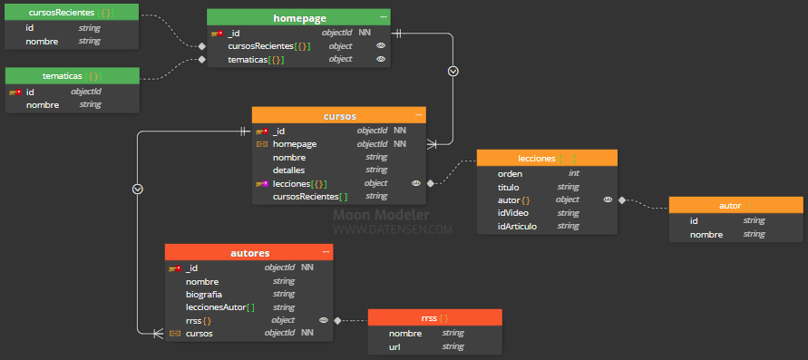
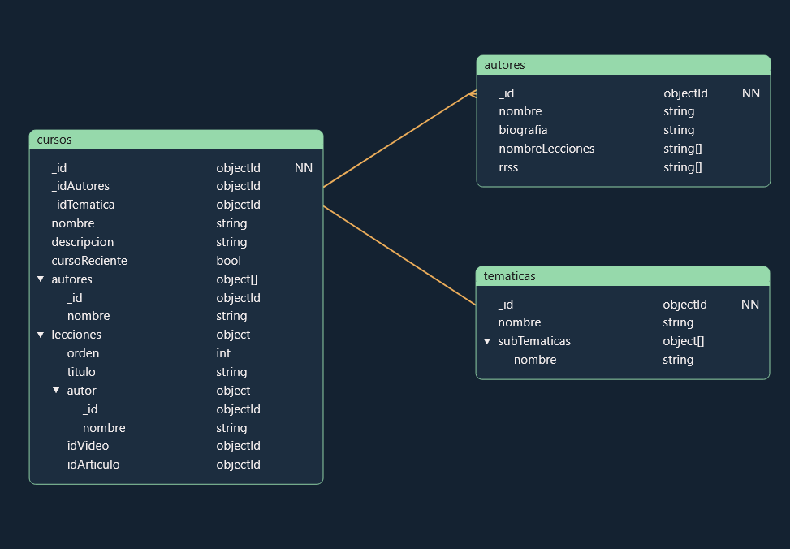
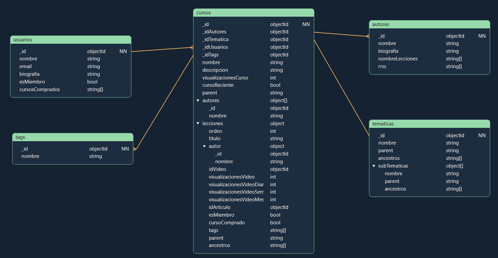

# 00-modelado-mongodb

## Caso basico

Subset pattern añadido en cursos.lecciones.autor para mejorar el rendimiento del working set. He debatido mucho el poner una colección de homepage o no, pero finalmente lo metí por poder añadir un campo de cursos recientes y uno de temáticas. El de temáticas lo puse en el homepage porque realmente en el mock no se ve reflejado de qué temática es cada curso dentro de las páginas de curso, por lo que lo he dejado en el homepage, pero no sé siquiera si debería haberle dejado campos de id y de nombre embedido, o si con haber hecho campo de nombre solamente sin embedir nada hubiera bastado.

Lo de cursosRecientes dentro de cursos realmente lo he dejado ahí pero quería borrarlo.

He hecho otro modelo diferente con Mongo Modeller, he intendado obviar la colección de homepage directamente y usar solo la información que debería ser usada en el homepage para crearlo en front. La diferencia más obvia aquí es la booleana de los cursos recientes, que dependiendo de que entren más cursos a la página se irán convirtiendo en false. Las temáticas y los cursos siguen incorporando objects con las lecciones, autores y subtemáticas embedidas a sus respectivas colecciones. Además el subste pattern sigue presente, teniendo en cuenta tener las páginas de los autores y las temáticas a parte de la de cursos.

## Caso opcional

Este lo he hecho en Mongo Modeller directamente. Las temáticas las dejé embedidas en los cursos, pero también he creado una colección a parte para acceder a la página de temáticas y subtemáticas por separado. Tienen una estructura de tree pattern que funcionaría así: homepage -> curso -> temática -> subtemática. El homepage entra en el pattern a pesar de no ser representado en el modelo directamente, se debería de crear en la parte de front end. También he añadido bools en las lecciones y en la colección de usuario para comprobar si un usuario es miembro y qué cursos ha comprado, así si hay un curso que es gratis al principio, puede diferenciar al usuario que solo pueda ver las lecciones gratis y los que deberían ver más. Además, hay un contador de visualizaciones para el vídeo y los cursos que precarga la información que haya guardada en el total de visualizaciones, los contadores se podrían ir cambiando a la hora o tal vez al día. Hay contadores extras también por si queremos ver la información más fácilmente al hacer un query. Finalmente hay una colección de tags que también está embedida en las lecciones para fácil acceso dentro de la página.